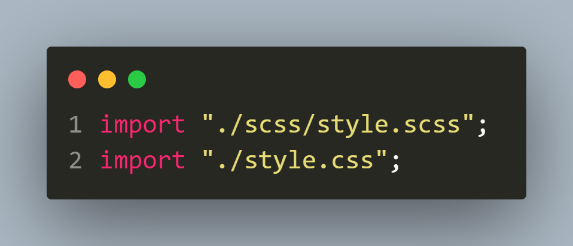

# Huddle Landing Page with Curved Sections

This is a solution to the **Huddle Landing Page with Curved Sections** challenge from [Frontend Mentor](https://frontendmentor.io)

## Preview

### Desktop Preview


### Mobile Preview


## Tools and Languages

### Tools

- [Visual Studio Code](https://code.visualstudio.com)
- [Vite](https://vitejs.dev)
- [Brave](https://brave.com)
- [Firefox](https://mozilla.org/firefox)
- [Validator Library](https://www.npmjs.com/package/validator)

### Languages

- Semantic HTML5
- CSS
- SCSS
- JS

## Process

The full command line process is given below

### Create Vite App

```sh
npm create vite@latest -- --template vanilla app
```

```sh
cd app
```

#### Install dependencies and packages

```sh
npm install

npm add sass -D

npm install validator
```

### Import the files with JavaScript



### Preview the website

```
npm run dev
```

## Using Validator

Here's how the Validator library is used in this project.


## Links

- [GitHub Repository](https://github.com/Code-Beaker/huddle-page-curved-sections-code-beaker)
- [Live Site URL](https://huddle-page-curved-sections-code-beaker.vercel.app/)
